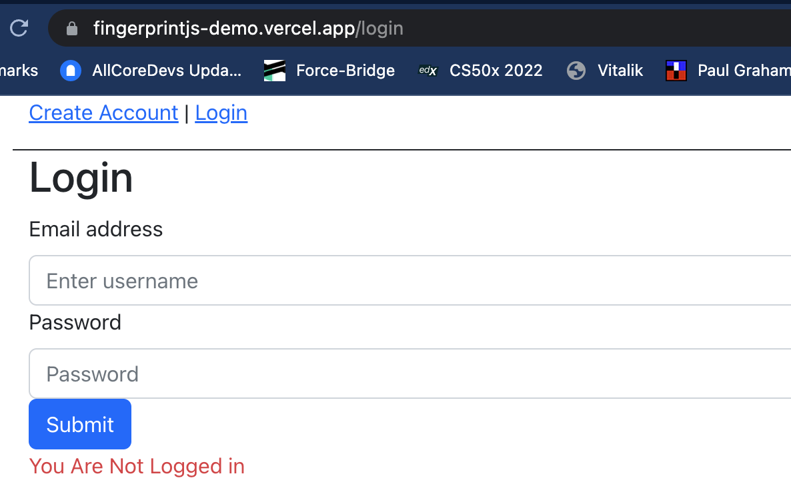

# FingerPrintJS-DEMO

This DEMO was built using ReactJS, ExpressJS, NodeJS and an SQLite DB.

To run the project, open 2 separate terminals, one will be for running the `UI` and the second for running the `server`.

<br>
Clone the Project to your local Machine.
<br>
First install the project dependencies using: `npm install`

<br>
To run the UI, use the command: `npm start`
Open [http://localhost:3000](http://localhost:3000) to view it in your browser.



<br>
To run the server, use the command: `nodemon server/server.js`
Open [http://localhost:5000](http://localhost:5000) to view it in your browser or using the Postman App.

<hr />
The DEMO is separated into the `UI` and the `SERVER` directories.
<hr />

## This README doc will walk you through how to implement FingerPrintJS in a project.

## UI

The UI contains the `signup` and `login` pages with the `fingerprintjs` implemented for the signup. FPJS is implemented in the UI using [FingerPrintJS Pro React](https://www.npmjs.com/package/@fingerprintjs/fingerprintjs-pro-react)

According to the FPJS docs:

> _Wrap your application (or component) in FpjsProvider_

The entire ReactDOM is wrapped using FPJS. Open the `index.js`, you will find the `FpjsProvider` import.

```js
import { FpjsProvider } from "@fingerprintjs/fingerprintjs-pro-react";
```

The React App is wrapped using the FpjsProvider, specifying your API KEY.

```js
<FpjsProvider
  cacheLocation="memory"
  loadOptions={{
    apiKey: process.env.REACT_FPJS_KEY,
  }}
>
  ...
</FpjsProvider>
```

The FpjsProvider is used to get the unique `visitorID` which is then parsed to the server via the signup form. The visitorID is used to check for the user authenticating to the App during login.

To implement the FPJS via the signup, we will return the visitorID of the user and parse it to the server. There is a signup form implemented using BootStrap Form. It takes in a `username` and `password` as login credentials for the user.

Using an Axios request, the signup credentials are sent to the server API.

FPJS React Pro contains the `useVisitorData` method which returns among other things, the visitorID of the user. We collate this data via the signup page so that it can be stored in the DB schema and associated with the unique username during login authentication. Open the `signup.js` page to see it's implementation.

Import the useVisitorData

```js
import { useVisitorData } from "@fingerprintjs/fingerprintjs-pro-react";
```

In the `handleSubmit` function, the `data` is returned and the visitorID is assigned to the `visitorId` variable. In the Axios POST request, the visitorId is parsed as one of the credentials to the server API.

```js
const handleSubmit = (e) => {
  e.preventDefault();

  console.log(username, password);

  if (data) {
    const visitorId = data.visitorId;

    axios
      .post("http://localhost:5000/api/signup", {
        username,
        password,
        visitorId,
      })
      .then((result) => {
        console.log("here3");
        console.log(result);
        setSignup(true);
      })
      .catch((error) => {
        console.log(error);
      });
  } else {
    return null;
  }
};
```

The FPJS is not implemented in the login page. This is because the visitorID is stored in the DB during a user signup and associated with the user's unique username. During login, this association is referenced and used to ensure that no unauthorised user (malicious user or BOT) can get access to a user account. This is due to the uniqueness of the FPJS visitorID.

<hr>

## Next, we will take a look at the Server API and review the implementation of FPJS

The Server contains the `API endpoints` and the `DB`. Below is the DB schema:

```js
`CREATE TABLE user (
            id INTEGER PRIMARY KEY AUTOINCREMENT,
            username text UNIQUE, 
            password text, 
            Token text,
            visitorID text,
            timestamp number
            )`;
```

When running the server in the terminal, you will also see the message:

```
Connected to the SQLite database.
```

When a new user is added to the DB, the user has an Id, username, password, visitorID, all used in login authentication.

The two important endpoints in the `server.js` file are `/api/signup` and `/api/login`.

Unlike the UI, the server uses a different FPJS library, it uses the [FingerPrintJS PRO SERVER API](https://www.npmjs.com/package/@fingerprintjs/fingerprintjs-pro-server-api).

To begin using the library, it is first imported into the server file and configured.

```js
const {
  FingerprintJsServerApiClient,
  Region,
} = require("@fingerprintjs/fingerprintjs-pro-server-api");

const apiKey = process.env.FPJS_KEY;
const client = new FingerprintJsServerApiClient({
  region: Region.Global,
  apiKey: apiKey,
});
```

The FPJS Server API returns the user visitor history by caling the `getVisitorHistory` method on the `client`. Referencing the docs:

```js
client.getVisitorHistory("<visitorId>", filter).then((visitorHistory) => {
  console.log(visitorHistory);
});
```

To use the `getVisitorHistory` method, we need the visitorID, and the FPJS Server API doesn't parse that information, which is why we used the FPJS React Pro library to send the visitorID from the UI to the server.

During the authentication from the UI, the signup endpoint is where the data from the signup page is posted, assigned to the data variable and inserted into the DB, if the process is without errors, it returns a success message

```js
var data = {
  username: request.body.username,
  password: md5(request.body.password),
  VisitorID: request.body.visitorId,
};

var sql = "INSERT INTO user (username, password,VisitorID) VALUES (?,?,?)";
var params = [data.username, data.password, data.VisitorID];

db.run(sql, params, function (err, result) {
  if (err) {
    response.status(400).json({ error: err.message });
    return;
  }
  response.json({
    //return success if no errors.
    message: "success",
    data: data,
    id: this.lastID,
  });
});
```

When the data from the UI is successfully saved in the DB, the login check can then be sufficient to prevent malicious activities from Bots attempting to login with user credentials. Let's review the user action required during login:

- User enters username and password to UI form.
- The Data is sent to the Server to check for the following conditions:
  - Does the username and password exist?
  - Is the username associated with the visitorID correct?
  - Where the username and password are correct, and the visitorID is not, that is a malicous user, prevent access.
  - Where a user is deemed malicious and the user is attempting 5 signup under 5 minutes, such a user is a BOT, lock out user!
- Else, login user successfully.

## Login Endpoint

First, we parse the username and password credentials from the UI, perfrom a DB lookup on the username, if the user is found

```js
if (user[0]) {
      console.log("OK");

      const filters = {
        limit: 5,
      };

        await client
          .getVisitorHistory(user[0].visitorID, filters)
```

If the `user[0].visitorID` does not exist, the login fails at this point. Also, we perform a check on the timestamps, to prevent BOT attempts, where the credentials are correct and visitorID is wrong:

```js
let setTime = [];
await client
  .getVisitorHistory(user[0].visitorID, filters)
  .then((visitorHistory) => {
    visitorHistory.visits.map((result) => {
      setTime.push(result.timestamp);
    });
  });

const result = TimeChecker(setTime[0], setTime[1]);

if (result === true) {
  return response
    .status(401)
    .send(
      "We detected multiple log in attempts for this user, but we didn't perform the login action"
    );
}
```

This DEMO shows how FingerPrintJS is implemented in an example to check against user login attempts.
